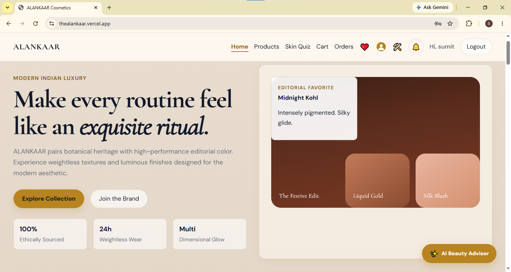
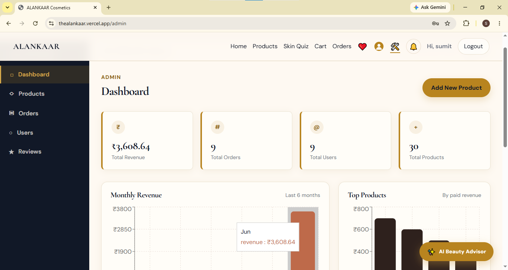
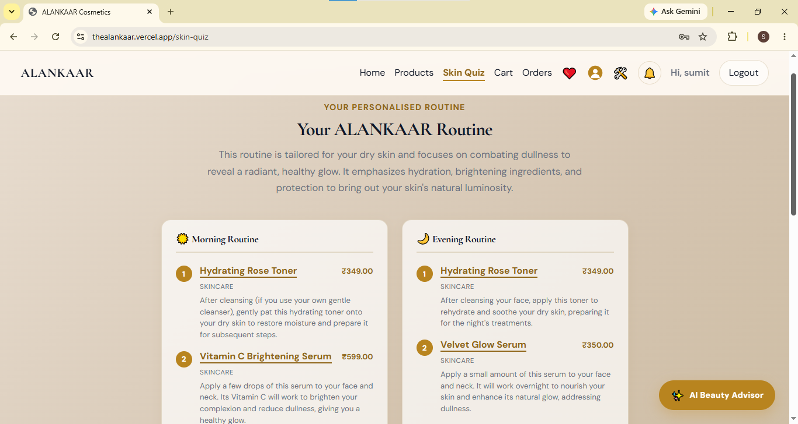
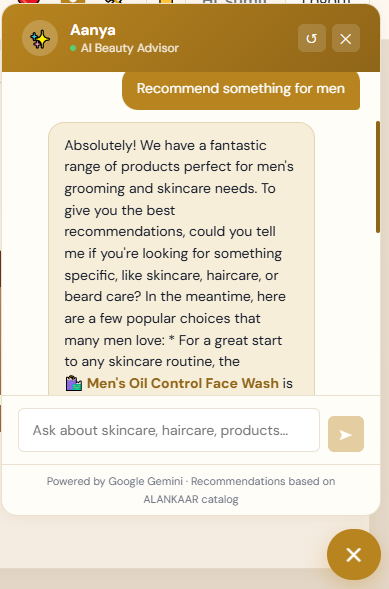

# ALANKAAR — E-Commerce Cosmetic Brand Website

Alankaar is a premium, full-stack MERN (MongoDB, Express, React, Node.js) e-commerce platform crafted for a high-end beauty and cosmetics brand. Built using modern design systems, clean architectural principles, and native web technologies, the application delivers real-time notifications, unified account controls, and secure online shopping.

---
## Live Demo:
(https://thealankaar.vercel.app)

## DEMO SCREENSHOTS 

### Home Page


### Admin Dashboard


### Skin Quiz


### AI Beauty Advisor


---

## ✨ Design & Visual Philosophy

Alankaar (meaning *ornament* or *decoration* in Sanskrit) features a warm, minimal, and premium aesthetic:
* **Harmonious Palette**: Built on curated warm tones, including rich terracotta (`#be6a4a`), light peach (`#f8efe8`), and deep brown charcoal (`#2e211d`).
* **Sleek Micro-Animations**: Interactive hover states with custom CSS scaling (`1.18x`) on navigation links, and glassmorphic surface cards designed to float cleanly on desktop and mobile viewports.
* **Streamlined Iconography**: Grouped aesthetic navigation icons for standard user workflows:
  * ❤️ **Wishlist**
  * 👤 **Profile Avatar** (Custom vector SVG cutout that shifts terracotta shades on active hover)
  * 🛠️ **Admin Panel**
  * 🔔 **Live Notification Bell** (Houses a real-time event listener and unread count badge)

---

## 🛠️ Features Summary

### 1. Account & Profile Hub
* **Unified Profile Panel**: Instead of scattered menus, a single centralized console houses **Profile Details** (name, phone, picture URL), **Change Password** inputs, and the **Address Book manager** nested cleanly as modular sub-cards.
* **Address Book**: Add, update, set defaults, or delete multiple shipping addresses inline without leaving the profile.

### 2. Live Notification System (SSE)
* **Real-time Server-Sent Events**: Replaces legacy polling entirely with a single, persistent event-stream (`/api/notifications/stream`).
* **Online Pushes**: Instantly pushes order status updates (e.g., from *Pending* to *Processing* or *Shipped*) directly to online clients as responsive React Hot Toasts.
* **Offline Queues & Batch Delivery**: If a user is offline when their order status changes, updates are stored in MongoDB. When they log back in, the SSE stream automatically sends a batch of unread notifications to sync their bell.
* **Resiliency**: Standardized 25-second heartbeat intervals to keep proxy connections alive on single-instance hosting platforms (like Render or Railway).

### 3. Transactional Emails (Brevo HTTP API)
* **Status Updates**: Automated HTML email triggers sent specifically for `shipped`, `delivered`, and `cancelled` statuses.
* **Premium Brand Templates**: Rich HTML templates featuring order breakdowns, items pricing, tax/shipping details, and real-time transaction information colored dynamically according to status.
* **HTTPS Port 443 Delivery**: Bypasses cloud platform SMTP port blocks by utilizing Brevo's HTTP JSON API.

### 4. Checkout & Cart Flow
* **Cart Sync**: Full local storage backup synchronized with MongoDB.
* **Strict Shipping Validation**: Validates full shipping details during checkout. Displays instant React Hot Toast alerts alongside red error banners to warn users of missing fields.
* **Razorpay Payment Gateway**: Integration with Razorpay (sandbox mode) verifying webhook payments securely.

### 5. Admin Fulfillment Controls
* **Interactive Fulfillment List**: Central dashboard to review order structures, customer metrics, and export data.
* **Fulfillment Lifecycle**: Interactive state changes (`Pending` → `Processing` → `Packed` → `Shipped` → `Delivered` → `Cancelled`) that immediately trigger the SSE push and transactional emails.

---

## 🏗️ Project Structure

```
├── backend/                    # Node.js/Express API Service
│   ├── src/
│   │   ├── app.js            # Express app middleware & routing setup
│   │   ├── server.js         # Port listening & DB connection initiator
│   │   ├── config/           # Database setup
│   │   ├── controllers/      # Route controllers (SSE, Auth, Admin, Orders)
│   │   ├── models/           # Mongoose Schemas (User, Order, Product, Notification)
│   │   ├── routes/           # Express routes
│   │   ├── middleware/       # JWT Auth verification, admin-only barriers
│   │   ├── utils/            # SSE Manager, Brevo helpers, email templates
│   │   └── seed/             # Catalog seeding
│   ├── .env.example          # Environment configuration defaults
│   └── package.json          # Server dependencies
│
├── frontend/                 # React 18 / Vite SPA
│   ├── src/
│   │   ├── main.jsx         # Entry point & provider injection
│   │   ├── App.jsx          # Route mapping & layout wrapper
│   │   ├── components/      # UI elements (Navbar, NotificationBell, Loaders)
│   │   ├── pages/           # Pages (Profile, Products, Checkout, Orders)
│   │   ├── services/        # Axios API handlers
│   │   ├── context/         # Auth, Cart, and SSE Notification contexts
│   │   └── styles/          # Variables & comprehensive global styling
│   ├── index.html           # Root HTML
│   ├── vite.config.js       # Vite build configurations
│   └── package.json          # Frontend dependencies
```

---

## 🔑 Environment Configuration

Create a `.env` file in the `backend/` directory based on `.env.example`:

```env
PORT=5000
NODE_ENV=development
MONGODB_URI=your_mongodb_connection_string
JWT_SECRET=your_long_secure_jwt_token_secret
CLIENT_URL=http://localhost:5173
RAZORPAY_KEY_ID=your_razorpay_key_id
RAZORPAY_KEY_SECRET=your_razorpay_key_secret

# Brevo Settings
BREVO_API_KEY=your_brevo_v3_api_key_starts_with_xkeysib
EMAIL_USER=your_verified_sender_email@domain.com
EMAIL_FROM=your_verified_sender_email@domain.com
```

Create a `.env` file in the `frontend/` directory:

```env
VITE_API_BASE_URL=http://localhost:5000/api
```

---

## 🚀 Running the Project

### Development Startup

**1. Start Backend Server:**
```bash
cd backend
npm install
npm run dev
```

**2. Start Frontend Dev Client:**
```bash
cd frontend
npm install
npm run dev
```

The frontend will run on [http://localhost:5173](http://localhost:5173) and request data from the backend running on [http://localhost:5000](http://localhost:5000).

---

## ⚡ API Endpoint Catalog

### 👤 Authentication & Profiles
* `POST /api/auth/register` - Create user account
* `POST /api/auth/login` - User login (returns JWT)
* `GET  /api/auth/me` - Get current session details
* `PUT  /api/auth/profile` - Update profile data (name, phone, avatar)
* `PUT  /api/auth/password` - Change password

### 📬 Real-time Notifications (SSE)
* `GET  /api/notifications/stream` - Establishes EventSource channel (accepts JWT query parameter)
* `GET  /api/notifications` - Fetch latest 20 notifications
* `PUT  /api/notifications/:notificationId/read` - Mark single notification as read
* `PUT  /api/notifications/read-all` - Mark all user notifications as read

### 🛍️ Cart & Checkout Actions
* `GET  /api/cart` - Retrieve current active cart
* `POST /api/cart` - Push item to cart
* `PUT  /api/cart/:itemId` - Update cart item quantity
* `DELETE /api/cart/:itemId` - Delete item from cart
* `POST /api/orders` - Place new order (calculates totals and updates catalog stocks)

---

## 🔒 Security & Performance Features

* **Password Security**: Passwords are mathematically hashed with strong salt rounds via `bcryptjs` before storage.
* **Token Guard Rails**: Secure endpoints require signed JSON Web Tokens (JWT) verified inside the `protect` middleware.
* **HTTP Headers**: Enforces strict security layers using `helmet` to mitigate cross-site script execution.
* **Connection Safety**: Zero mock user-transaction inject locks are enforced at the Mongoose abstraction layer to safeguard organic customer profiles and order histories.
